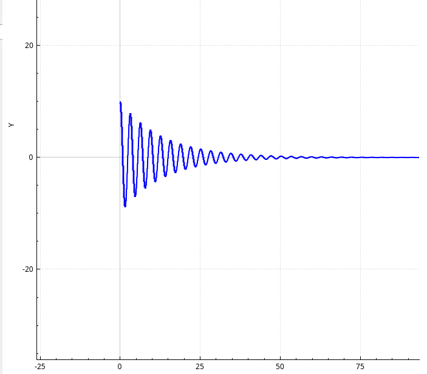

## КСР (уч. 2)

### Описание задания 

Дано уравнение динамической системы, состоящей из груза, пружины и демпфера:

$mu'' + cu' + ku = 0$, где m - масса груза, k - жесткость системы, c - коэфф. демпфирования.

$u(t) = C_{1}e^{-\alpha t}cos(\beta t) + C_{2}e^{-\alpha t}sin(\beta t)$, где 
$ \alpha = \frac{-c}{2m}, \beta = \frac{\sqrt{4km - c^2}}{2m}$

Начальные условия: u(0) = 10, u'(0) = 0, (m = 1, c = 0.15, k = 2).

Необходимо решить данное уравнение при заданных параметрах системы с помощью метода Рунге-Кутта 3-го порядка и исследовать влияние параметров системы на её поведение. 

### Ход работы

Система при параметрах из постановки задачи (m = 1, c = 0.15, k = 2)

В данном случае система испытывает затухающие колебания.

Подставим другие параметры и посмотрим, что будет происходить с системой. 

1) m = 1, c = 2, k = 2

В данном случае был увеличен коэффициент демпфирования из-за чего система быстро пришла к устойчивому состоянию равновесия

2) m = 5, c = 0.15, k = 2

Теперь увеличим массу груза 

С большей массой система совершает затухающие колебания с меньшей частотой.

3) m = 1, c = 0.15, k = 4

С увеличенной жёсткостью пружины, система совершает колебания с большей частотой. 

